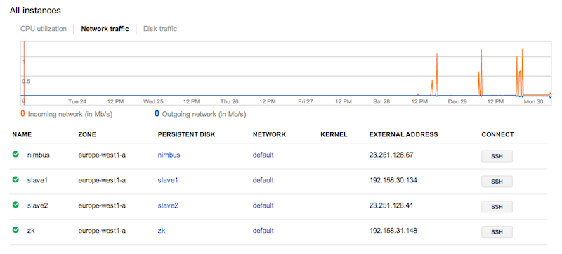
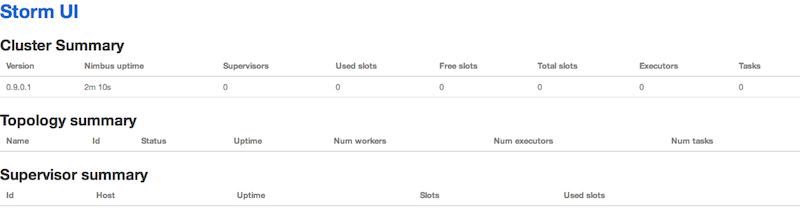

# Storm deployment on GCE

This repo provides scripts and resources to deploy [Storm](http://storm-project.net/) 
on Google Compute Engine ([GCE](https://cloud.google.com/products/compute-engine/)).

In the following, I assume you're familiar with [GCE](https://developers.google.com/compute/docs/getting-started-with-compute)
and that you have `gctuil` up and running. For a deep dive into the topic, incl. manual set up, consult the blog post
[Deploying Storm on GCE](http://datadventures.markbox.io/2013/12/29/storm-on-gce).

## Install

In the [GCE console](https://cloud.google.com/console), create a project with
the ID `storm-simple` and enable billing for it. Then,  you need to do some 
(one-time) authentication:

    $ gcutil --project=storm-simple auth

Then, you can launch the following script that provisions the four instances 
and prepares them for their roles (1 x ZooKeeper, 1 x Nimbus, 2 x Slaves).

    $ ./install_storm_on_gce.sh

In my case, this resulted in a cluster with the following layout:

 

Note that the IPs stem from using [reserved/static IP addresses](https://developers.google.com/compute/docs/instances-and-network#externaladdresses) 
and that you will experience different IPs.

After this you can ssh into any of the instances of the 4 node cluster, 
for example into the `nimbus` instance:

    $ gcutil --project=storm-simple ssh nimbus

Once in the instance, you need to start the respective services 
(the install script also downloads the necessary scripts into `~/cluster`):

    [mhausenblas@zk ~]$ cluster/cluster_launch_zk.sh

    [mhausenblas@nimbus ~]$ cluster/cluster_launch_nimbus.sh
    [mhausenblas@nimbus ~]$ cluster/cluster_launch_nimbus_ui.sh

    [mhausenblas@slave1 ~]$ cluster/cluster_launch_supervisor.sh

    [mhausenblas@slave2 ~]$ cluster/cluster_launch_supervisor.sh

And finally, you can also have a look at the Nimbus WebUI at 
[http://nimbus:8080](http://nimbus:8080/) which should look something like:

 

## Use

To submit a [topology](https://github.com/nathanmarz/storm/wiki/Tutorial#topologies)
we first need to prep the machine we submit it from. I assume you've cloned this
repo into a directory `~/storm-on-gce` and then you'd do the following:

    $ mkdir ~/.storm
    $ cp ~/storm-on-gce/templates/template_storm.yaml ~/.storm/storm.yaml

With this, and assuming you've updated your local `/etc/hosts` with the
respective values for your instances, the local machine is aware of the Storm 
cluster and ready to receive a topology.

We will use nathanmarz/[storm-starter](https://github.com/nathanmarz/storm-starter/)
for a test drive:

    $ cd /tmp
    $ git clone git@github.com:nathanmarz/storm-starter.git
    $ cd storm-starter
    $ lein deps
    $ lein compile
    $ lein uberjar
    $ storm jar target/storm-starter-0.0.1-SNAPSHOT-standalone.jar storm.starter.ExclamationTopology exclamation-topology
    ...
    0    [main] INFO  backtype.storm.StormSubmitter  - Jar not uploaded to master yet. Submitting jar...
    73   [main] INFO  backtype.storm.StormSubmitter  - Uploading topology jar target/storm-starter-0.0.1-SNAPSHOT-standalone.jar to assigned location: /app/storm/nimbus/inbox/stormjar-ef3376c5-85d4-4a65-bbde-a266f17609d1.jar
    2973 [main] INFO  backtype.storm.StormSubmitter  - Successfully uploaded topology jar to assigned location: /app/storm/nimbus/inbox/stormjar-ef3376c5-85d4-4a65-bbde-a266f17609d1.jar
    2973 [main] INFO  backtype.storm.StormSubmitter  - Submitting topology exclamation-topology in distributed mode with conf {"topology.workers":3,"topology.debug":true}
    3256 [main] INFO  backtype.storm.StormSubmitter  - Finished submitting topology: exclamation-topology

To see if it works, do the following:

    $ storm list
    0    [main] INFO  backtype.storm.thrift  - Connecting to Nimbus at nimbus:6627
    Topology_name        Status     Num_tasks  Num_workers  Uptime_secs
    -------------------------------------------------------------------
    exclamation-topology ACTIVE     18         3            401

## License
[Apache License, Version 2.0](http://www.apache.org/licenses/LICENSE-2.0.html).
